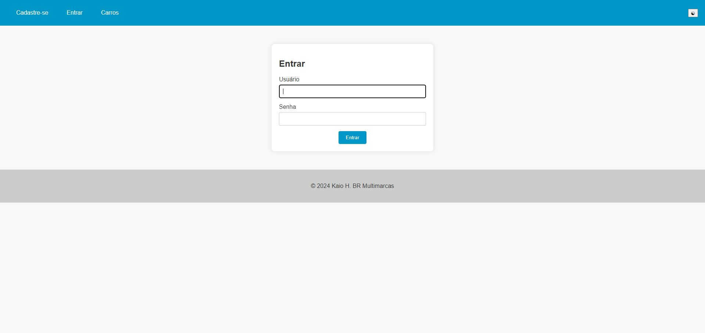
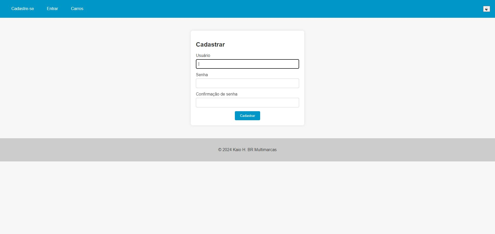
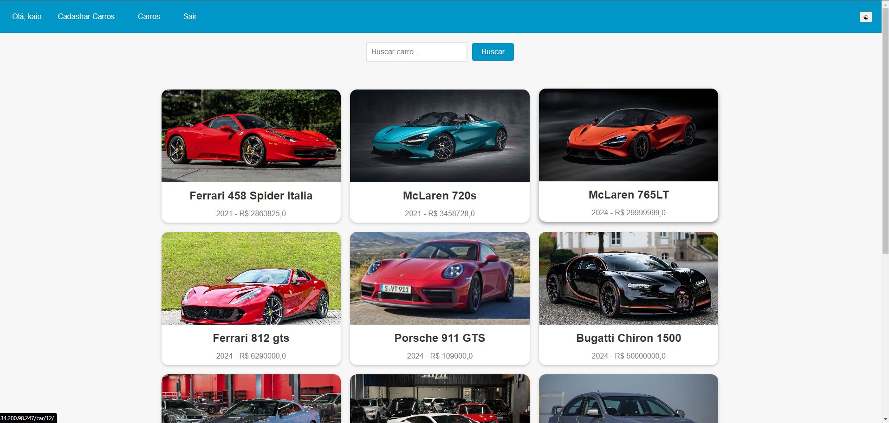
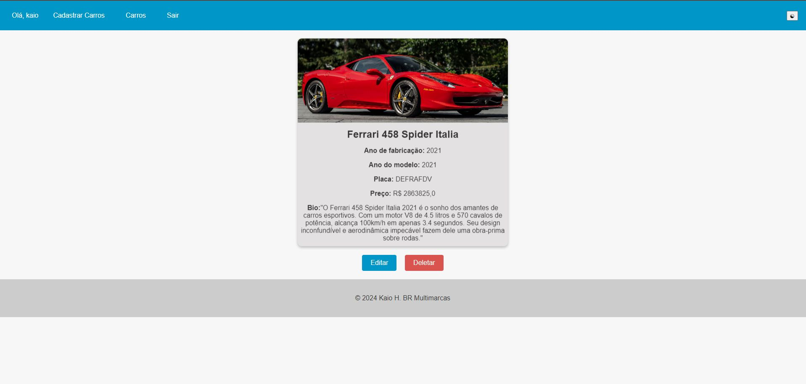
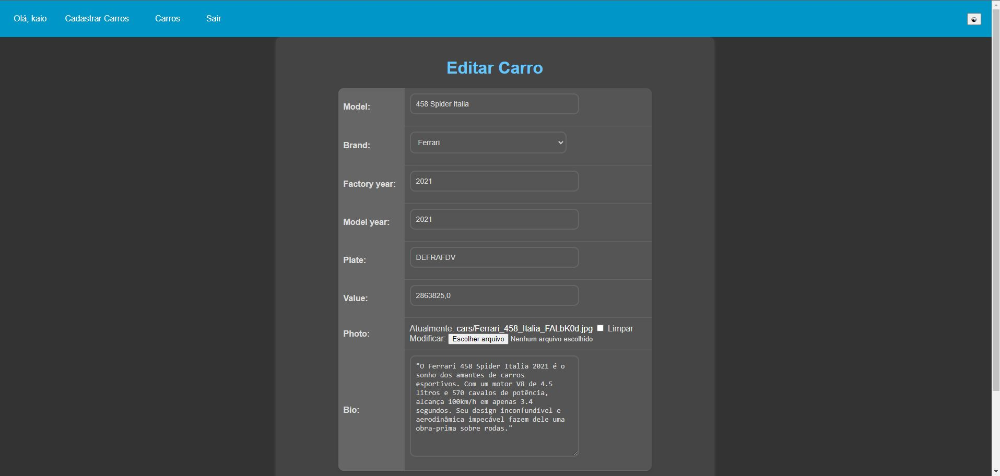

# Carros

Este é um projeto Django para gerenciar um catálogo de carros. Ele permite que os usuários visualizem, cadastrem, atualizem e excluam informações sobre carros.

## Funcionalidades

- Listagem de carros
- Detalhes de um carro específico
- Cadastro de novos carros
- Atualização de informações de carros
- Exclusão de carros
- Autenticação de usuários (registro, login e logout)
- Suporte a modo escuro

## Tecnologias Utilizadas

- Django
- SQLite
- HTML/CSS
- JavaScript

## Instalação

1. Clone o repositório:
    ```sh
    git clone https://github.com/seu-usuario/carros.git
    ```

2. Navegue até o diretório do projeto:
    ```sh
    cd carros
    ```

3. Crie um ambiente virtual e ative-o:
    ```sh
    python -m venv venv
    source venv/bin/activate  # No Windows use `venv\Scripts\activate`
    ```

4. Instale as dependências:
    ```sh
    pip install -r requirements.txt
    ```

5. Execute as migrações do banco de dados:
    ```sh
    python manage.py migrate
    ```

6. Inicie o servidor de desenvolvimento:
    ```sh
    python manage.py runserver
    ```

## Uso

- Acesse `http://127.0.0.1:8000` no seu navegador.
- Registre-se ou faça login para acessar as funcionalidades de cadastro, atualização e exclusão de carros.

## Estrutura do Projeto

- [accounts](http://_vscodecontentref_/0): Aplicação responsável pela autenticação de usuários.
- [app](http://_vscodecontentref_/1): Configurações principais do projeto Django.
- [cars](http://_vscodecontentref_/2): Aplicação principal para gerenciamento de carros.
- [media](http://_vscodecontentref_/3): Diretório para arquivos de mídia (imagens de carros).
- [static](http://_vscodecontentref_/4): Arquivos estáticos (CSS, JavaScript).
- `templates/`: Templates HTML.

## Configuração do uWSGI

O projeto inclui arquivos de configuração para uWSGI (`carros.ini` e [carros_uwsgi.ini](http://_vscodecontentref_/5)) para implantação em um servidor de produção.

## 📷 Capturas de Tela

### Login:


### Cadastre-se:


### Home:


###  Detalhes:


### Editar Carro:



